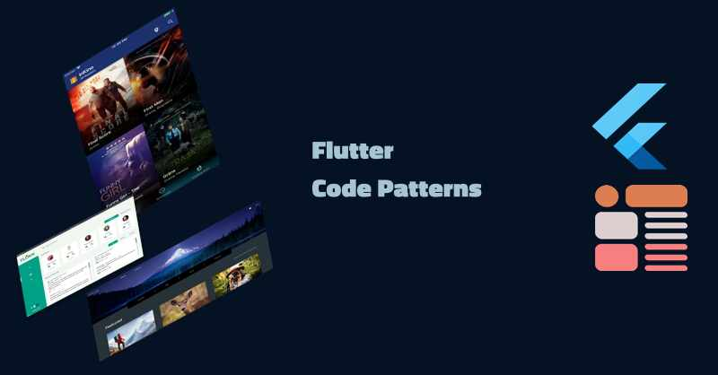

# Flutter Code Patterns

A more complete introduction to Flutter Code patterns including both Dart OOP and FP patterns and App Arch patterns including 
State and DI app patterns.

## Articles

## About Fred Grott 
I use KeyBase for my communications:

[KeyBase](https://keybase.io/fredgrott)

I publish Front End dev and design articles at medium:
[medium](https://fredgrott.medium.com)

You can viewe my social posts on:

[Twitter](https://twitter.com/fredgrott)

[Dribbble](https://dribbble.com/FredGrott)

[DeviantArt](https://www.deviantart.com/shareme)

[BeHance](https://www.behance.net/gwsfredgrott)

My bootstrap Studio presence:
[studio](https://fredgrott.github.io)

## Useful Resources

GumRoad products such as UI Kits and Books on Flutter development
[GumRoad Products](https://app.gumroad.com/fredgrott)

MaterialUp products such as UI Kits
[MaterialUp Products](https://www.uplabs.com/fred_grott)

